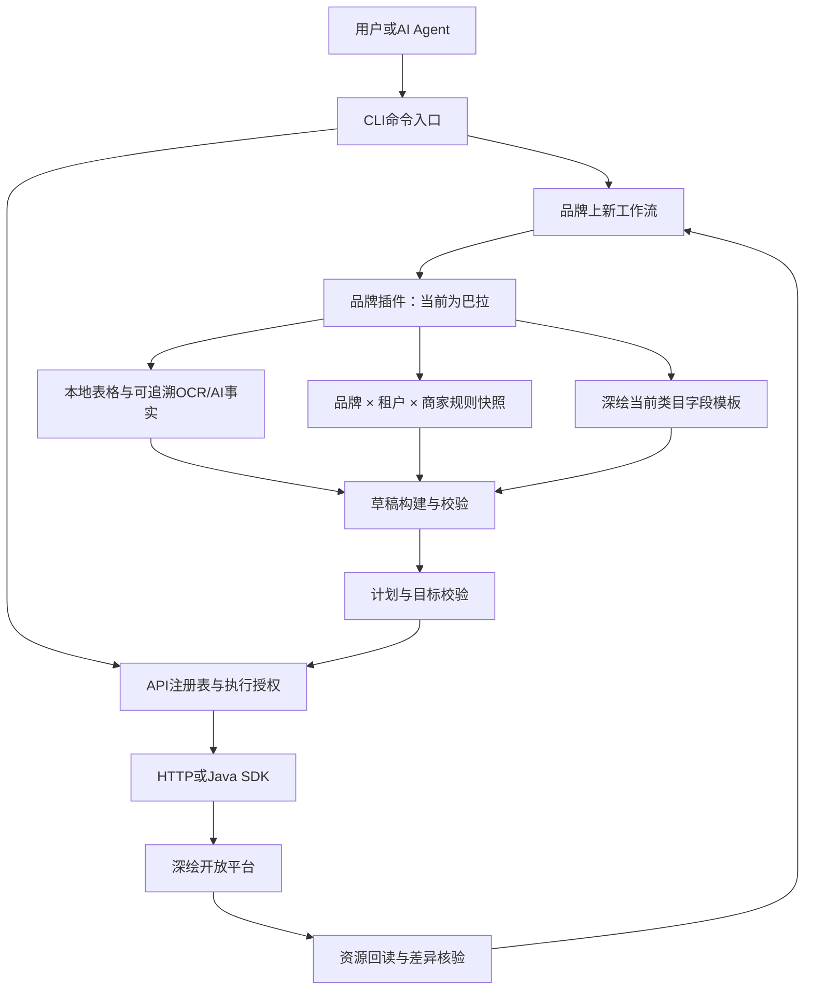

# DeepDraw CLI

`deepdraw` 是面向公司内部开发者和 AI agent 的深绘开放平台 OpenAPI 命令行客户端。它把深绘接口调用做成一层可 dry-run、可生成执行计划、可显式授权、可审计的本地工具，避免 agent 或脚本直接拼签名、直接写入、直接触发付费接口。

这个项目目前服务于 Listingify / 深绘上新自动化一类工作流：读取商家、类目、字段模板、商品资料，创建或更新深绘商品，并把商品内容包整理成更适合 AI agent 消费的结构化摘要。

当前接口事实以源文件《深绘开放平台API接口文档20260827.pdf》的 96 页内容为准，仓库机器可读镜像见 [`docs/reference/deepdraw-openapi.md`](docs/reference/deepdraw-openapi.md)；该快照已纳入 SDK 1.6.24 的修改历史和字段增量。PDF 中的示例只说明请求形状，不是执行授权。

## 阅读路径

- 只想调用某个 OpenAPI：从[快速上手](#快速上手)和[常用命令](#常用命令)开始；所有 `dp.*` 接口都受 registry、dry-run 和风险授权约束。
- 要走巴拉巴拉上新：直接阅读[巴拉上新流程](#巴拉上新流程)。这里解释本地资料导入、测试/正式款号授权、类目模板、AI/OCR 审计、全量/增量更新和回读。
- 要排查频控：阅读[调用频率与退避](#调用频率与退避)。只读请求会有限重试；任何可能写入的请求都不会自动重放。
- 要接入新的品牌：阅读[项目架构](#项目架构)；品牌规则位于专属插件，已有品牌/租户快照隔离接口；当前工作流和 payload 仍包含巴拉专用逻辑，其他品牌需单独实现并验证。

## 项目背景

深绘开放平台的接口有几类现实问题：

- 接口数量多，`dp.*` 参数、版本、风险级别不容易靠记忆维护。
- 部分接口是只读查询，部分接口会写入商品、消耗付费能力或需要谨慎调用。
- 商品创建和更新依赖深绘 Java SDK 的 entity mapping，手写 JSON 容易出现后端序列化问题。
- AI agent 需要一个稳定入口，能先确认参数和风险，再决定是否真实执行。
- Listingify 的上新链路需要兼顾 Node HTTP 签名请求和 Java SDK readback。

因此这个仓库提供一个统一 CLI：

- 所有参考文档里的 `dp.*` 接口都注册在 `src/core/api-registry.ts`。
- 低风险只读接口可以 dry-run 后执行。
- 写入、付费和慎用接口必须先生成执行计划，用户明确授权后才允许执行。
- 商品创建、更新、通用增量、颜色/SKU 增量更新和商品资源读取走 DeepDraw Java SDK bridge。
- 简单元数据和查询接口走 TypeScript HTTP 签名请求。

## 能实现什么效果

使用这个 CLI 后，agent 或开发者可以做到：

- 用一条 `deepdraw call <api-name>` 调用任意已注册深绘接口。
- 先用 `--dry-run` 检查接口和参数，不产生网络请求。
- 对高风险接口先生成计划，看到接口名、租户、参数摘要和风险级别。
- 只有加上 `--execute --yes` 后才真正执行写入、付费或慎用接口。
- 通过 `deepdraw product content` 直接拿到商品摘要、SKU 摘要、商品图片 URL、详情页 URL 和详情模块 URL。
- 通过 `deepdraw product payload` 在本地构建电商巴拉巴拉的商品发布 payload，并同时输出 `sizes.optionAliases`、`sizes.texts` 和 Java SDK 实际消费的商品实体。
- 通过状态型 `deepdraw balabala` 从本地 MDM/上市计划/文案/尺码表/图片资料重建可审计草稿，再按测试或正式授权目标进行同步、计划、发布与资源回读。
- 在 macOS / Windows 上通过同一套 SDK bundle 运行 Java bridge，无需 Maven 下载。
- 避免把真实 `appSecret`、`dopKey`、签名和租户凭据写入 tracked files。

## 快速上手

### 1. 安装依赖

```bash
npm install
```

### 2. 构建并链接本地命令

```bash
npm run build
npm link
```

链接后可以直接使用：

```bash
deepdraw --help
```

也可以不 link，直接运行构建产物：

```bash
node dist/cli/main.js --help
```

### 3. 检查本地环境

调用真实接口前，先跑：

```bash
deepdraw config doctor --dry-run
```

`doctor` 不联网，也不调用深绘接口。它会检查：

- `java` 是否可用
- `javac` 是否可用
- `vendor/deepdraw-sdk/dop-sdk-1.6.25.jar`
- `vendor/deepdraw-sdk/sdk-core-java-1.1.0.jar`
- `vendor/deepdraw-sdk/lib/*.jar`

当前 `dop-sdk-1.6.25.jar` 的 SHA-256 为 `3f57e6229b2b76ea633cf60f268d3db9691bc4b112c5d91d7aaf6c61229010f6`；来源与完整校验表见 [`vendor/deepdraw-sdk/README.md`](vendor/deepdraw-sdk/README.md)。

### 4. 配置凭据

推荐通过 stdin JSON 写入凭据，避免密钥留在 shell history 里：

```bash
deepdraw auth login --stdin-json < credentials.json
```

示例 `credentials.json`：

```json
{
  "tenantName": "租户名称",
  "merchantId": "1162",
  "appKey": "APP_KEY",
  "appSecret": "APP_SECRET",
  "dopKey": "DOP_KEY",
  "defaultTenant": true
}
```

`credentials.json` 只能保留在本地，不要提交。

默认配置路径：

- macOS/Linux: `~/.config/deepdraw/config.json`
- Windows: `%APPDATA%\DeepDrawCli\config.json`

环境变量优先于本地配置。完整 `DEEPDRAW_*` 环境变量存在时，CLI 会直接使用环境变量：

```bash
export DEEPDRAW_TENANT_NAME="租户名称"
export DEEPDRAW_BASE_URL="http://open.deepdraw.cn"
export DEEPDRAW_MERCHANT_ID="1162"
export DEEPDRAW_APP_KEY="APP_KEY"
export DEEPDRAW_APP_SECRET="APP_SECRET"
export DEEPDRAW_DOP_KEY="DOP_KEY"
```

## 运行依赖

### Node.js

项目要求 Node.js 20 或更高版本。核心脚本：

```bash
npm test
npm run lint
npm run build
```

### Java 和 DeepDraw SDK

以下接口通过 Java SDK bridge 执行：

- `dp.product.create`
- `dp.product.update`
- `dp.product.incremental.update`
- `dp.product.sku.color.incremental.update`
- `dp.product.resource`

这些接口需要本机可用的 `java` 和 `javac`。仓库已经内置 DeepDraw SDK jar 和 Java SDK 运行依赖 jar：

- `vendor/deepdraw-sdk/dop-sdk-1.6.25.jar`
- `vendor/deepdraw-sdk/sdk-core-java-1.1.0.jar`
- `vendor/deepdraw-sdk/lib/*.jar`

`vendor/deepdraw-sdk/lib` 目录必须保留，因为 `sdk-core-java-1.1.0.jar` 会引用 FastJSON、Apache HttpClient、OkHttp、Guava、SLF4J 等依赖。公司内部正常使用时无需 Maven 下载。

如需指定另一套 SDK 目录：

```bash
export DEEPDRAW_SDK_DIR=/absolute/path/to/deepdraw-sdk
```

或直接指定完整 classpath：

```bash
export DEEPDRAW_SDK_CLASSPATH="/absolute/path/deepdraw-sdk/*:/absolute/path/deepdraw-sdk/lib/*"
```

Windows PowerShell：

```powershell
$env:DEEPDRAW_SDK_DIR="C:\deepdraw-sdk"
$env:DEEPDRAW_SDK_CLASSPATH="C:\deepdraw-sdk\*;C:\deepdraw-sdk\lib\*"
```

第一次执行 Java SDK 接口时，CLI 会把 Java bridge class 编译到 `.deepdraw-sdk/classes`。这是本地生成目录，已被 git 忽略。

## 常用命令

### 查看帮助

```bash
deepdraw --help
deepdraw call --help
```

### 通用 dry-run

```bash
deepdraw call dp.colors.get --dry-run
deepdraw call dp.product.resource --param productCode=208226102001 --param resource=form --dry-run
```

不加 `--execute` 时，`deepdraw call` 默认也是 dry-run，不会联网。

### 执行只读接口

```bash
deepdraw call dp.colors.get --execute
deepdraw call dp.product.basic.search --execute --param merchantId=1162 --param productCodes=208226102001
```

部分接口如果 `merchantId` 是必填项，CLI 可以从已解析配置里补默认商户。

### 抽取商品内容包

Listingify 常用的商品资料读取，优先用：

```bash
deepdraw product content --product-code 208326105214 --summary --assets --dry-run
deepdraw product content --product-code 208326105214 --summary --assets --execute
```

`deepdraw product content` 底层通过 Java SDK 调用 `dp.product.resource`，但不会直接输出完整原始大 JSON，而是抽取：

- `summary`: 款号、DeepDraw productId、标题、品牌、类目、颜色数、尺码数、SKU 数、图片数、详情页资源数。
- `skus`: 颜色、尺码、商家编码、条形码、SKU 编码、价格、数量。
- `assets.pictures`: 商品图片 URL，含 `place`、`pictureType`、`skc`、颜色、尺寸、水印标记。
- `assets.detailPages`: 详情页图片版 URL、截图切片 URL，以及 `templateWidth`、`templateSites`、`active`。
- `assets.detailModules`: 详情模块 URL。
- `assets.videos`: 视频平台、视频类型、地址、封面、尺寸、排序、比例和模板来源。
- `summary.remark`、`summary.complete`、`summary.tags`: 产品备注、草稿状态和产品标签；`complete=false` 表示草稿。

也支持资源过滤参数：

```bash
deepdraw product content \
  --product-code 208326105214 \
  --resource form \
  --skc skc01,skc02 \
  --material 1 \
  --video 1 \
  --detail-page-site TMALL \
  --exclude-detail-page-modules usemap,尺码表 \
  --tags 春季,新品 \
  --summary \
  --assets \
  --execute
```

### 本地构建巴拉巴拉商品发布 payload

这个命令只读取本地 JSON，默认按租户 `电商巴拉巴拉`、商户 `1162` 组装，不读取凭据、不联网、不调用 Java，也不会创建或更新深绘商品：

```bash
deepdraw product payload --input draft.json --stage create --pretty
deepdraw product payload --input draft.json --stage update --pretty
```

也可以直接传 JSON：

```bash
deepdraw product payload \
  --json '{"code":"204426140121","title":"巴拉巴拉儿童运动鞋","tradeId":"546","productType":"shoe","fields":[],"skus":[]}' \
  --stage create \
  --pretty
```

输入文件可以是草稿对象，也可以包在 `product`、`draft` 或 `payload` 下。核心字段如下；字段数组中的值支持 `value`、`value_text` 或 `value_json`：

```json
{
  "code": "204426140121",
  "title": "巴拉巴拉儿童运动鞋",
  "tradeId": "546",
  "productId": "6518125",
  "productType": "shoe",
  "date": "2026-09-04",
  "retailPrice": 359.9,
  "sizeRemarks": { "26码": "脚长15.8-16.2/内长17" },
  "fields": [
    { "field_name": "颜色", "field_type": "TEXT", "value_text": "蓝色,蓝色调00388" },
    { "field_name": "尺码", "field_type": "MULTI_CHOICE", "value_text": "26;27" },
    {
      "field_name": "尺码表",
      "field_type": "MULTI_TEXT",
      "value_json": {
        "title": "尺码,适合脚长,内长",
        "26": "15.8,17",
        "27": "16.3,17.7"
      }
    }
  ],
  "skus": [
    { "skuCode": "sku-26", "skcCode": "skc-00388", "color": "蓝色调00388", "size": "26", "sellerCode": "seller-26", "price": 359.9 }
  ]
}
```

输出中的边界：

- `sdkInput.product` 是传给 Java SDK bridge 的商品实体；真正调用 `dp.product.create/update` 时，应把它单独保存为 body，并继续使用 CLI 的 `--plan`、`--yes` 授权流程。顶层输出不是 `deepdraw call` 的直接 body。
- `sdkInput.query` 是本地审查用的 query：创建阶段为 `merchantId + tradeId`，更新阶段为 `productId`；`sdkInput.config` 只放非敏感的商户/类目参数，不含 appSecret、dopKey 或签名。
- `fields` 是当前阶段发送的可审查字段；`legacyUpdateFields` 是完整更新字段集。因为 `dp.product.update` 是覆盖式更新，更新输入必须包含完整商品字段、颜色、销售尺码、商家 SKU、主尺码表和已有平台尺码表，不能拿一个小 patch 当全量 body。
- `sizes.options` 是规范尺码，`sizes.optionAliases` 是规范尺码到展示尺码的映射，`sizes.texts` 是按 `s<尺码>,<展示值>,<平台>` 组装的备注/平台文本；这三项会和 `sdkInput.product.fields` 一起输出供审查。

巴拉巴拉最新尺码组装规则：

- 鞋品的销售尺码使用整数规范值（例如 `26`、`27`），禁止生成半码；展示别名为 `26码`、`27码`。销售尺码备注使用 `26码*脚长15.8-16.2/内长17;...`，主表固定为 `尺码,脚长,鞋内长`，传给 SDK 时去掉重复的销售尺码列，变成 `脚长,鞋内长`。
- 鞋品多平台尺码固定六列 `天猫,京东,拼多多,微信视频小店,小红书,快手`：天猫和快手留空，京东使用裸数字，拼多多/微信视频小店/小红书使用带备注的展示值。
- 服饰销售尺码使用带 `cm` 的展示值；主尺码表第一列为 `140cm`，第二个尺码列为裸数字 `140`。上装和牛仔裤使用固定列顺序；缺失测量值留空，不填 `0`；巴拉巴拉服饰尺码会补内置体重参考（例如 `140 -> 31kg`）。
- 创建阶段发送主尺码表和多平台尺码；更新阶段保留主表、唯品会、天猫、抖音及多平台尺码，连同颜色、SKU 一起作为完整更新输入。鞋品不支持的 `淘宝尺码表` 会被省略并在 `diagnostics.warnings` 中说明。

本地构建结果通过审查后，真实写入仍必须分两步：先对 `dp.product.create` 或 `dp.product.update` 运行 `--execute --plan`，得到用户明确授权后，才允许 `--execute --yes`。HTTP 200 或业务码 `10200` 只代表请求接受，资源回读仍需单独验证。

### 巴拉上新流程

`deepdraw balabala` 将上述本地字段组装与 Listingify 的深绘上新顺序组合成可审计的流程。每次输出带有 `workflow: "balabala-listing"` 和动作名；它仍通过已注册的 `dp.*` 接口执行，不绕过计划和授权。

新版状态型流程把业务资料保存在当前目录的 `.deepdraw-workflows/balabala/<款号>/`：其中有原子状态、来源哈希、标准化资料、当前类目模板、草稿、AI/OCR 审计、计划、执行和回读。该目录已被 Git 忽略，不保存原始表格/图片、凭据、签名或 token。工作流核心只管理状态与已注册的 DeepDraw 调用；巴拉插件独立管理资料列别名、类目评分、字段、颜色、SKU 和尺码规则，因此其他品牌可接入自己的插件而不用复制巴拉规则。

完整链路如下。除标记为“本地”的步骤外，每个远端步骤都会先按模式和精确款号授权，再经 `api-registry` 调用对应的 `dp.*` 接口。

| 顺序 | 命令 | 结果与边界 |
| --- | --- | --- |
| 1 | `import` | 本地导入 MDM、上市计划、文案、尺码表和图片；仅按 `sourceSpu` 筛选正式资料，不读取凭据、不联网。 |
| 2 | `template` | 读取 `dp.merchant.trades` 和当前 `dp.trade.fields`，选择叶子类目并重建当前模板草稿。 |
| 3 | `review` | 本地审查来源、必填字段、AI/OCR 候选、SKU、颜色和尺码表；阻断项未消除时不能计划。 |
| 4 | `sync` | 以 `resource=form` 读取既有档案，保存数值 `productId` 与资源 UUID，并验证返回款号正好等于目标。 |
| 5 | `plan` | 生成不写入的执行计划与 `planHash`；全量更新会先读取远端并检查 SKU 交集。 |
| 6 | `publish` | 仅在 `--execute --yes` 后写入；随后自动 `resource=form` 回读。 |
| 7 | `readback` | 将结果标记为 `readback_verified`、`readback_mismatch` 或 `needs_ui_verification`。 |

#### 本地资料与字段重建

```bash
# 测试模式默认启用。--spu 是唯一可写的测试档案；默认仅允许这一条映射。
# 本地 MDM、上市计划、文案和尺码表仍按 sourceSpu=204426140121 筛选。
deepdraw balabala import --mode test --spu 204426140121-test \
  --mdm '/path/商品SKU表.xlsx' \
  --launch-plan '/path/上市计划表.xlsx' \
  --copywriting '/path/标准文案表.xlsx' \
  --shoe-size-chart '/path/巴拉鞋品尺码表.xlsx' \
  --images '/path/204426140121'

# 类目树和 dp.trade.fields 是当前字段 ID、枚举、必填、销售属性和子字段激活的唯一权威
deepdraw balabala template --mode test --spu 204426140121-test --execute
deepdraw balabala review --mode test --spu 204426140121-test
```

XLSX 导入扫描工作表真实单元格，不信任错误的 worksheet dimension，因此 `期货`/`O2O` 即使被标成 `A1` 仍能解析实际数据行。图片包会生成路径、角色和 SHA-256 审计；除 `jpg/jpeg/png/webp` 外，也会保留合格证、吊牌、洗标等 `PDF` 原件（`hangtag`/`washlabel`），只能作为 OCR/视觉证据，不能生成 MDM 颜色、SKU 或尺码事实。

AI/OCR provider 由业务或 agent 输出本地 JSON 后再交给 CLI 审计，CLI 不自行调用付费模型。AI 仅接受当前模板的激活枚举、具备证据且置信度至少 `0.7` 的建议；价格、条码、生产/合规、SKU、销售尺码、尺码量点和充绒量永远不可由 AI 填写。OCR 必须引用导入图片或 PDF 的 SHA-256 和原始文本，且字段 ID/名称必须命中当前深绘模板；采纳后字段会回链原始文件路径、哈希和角色。

```bash
deepdraw balabala review --mode test --spu 204426140121-test \
  --ai-responses /path/ai-responses.json \
  --ocr-facts /path/ocr-facts.json
```

#### 运行模式与款号授权

远端流程有两个显式运行模式，未传 `--mode` 时默认 `test`：

- `--mode test` 只允许配置中**精确**列出的 `targetSpu` 执行远端 `sync`、`readback` 和 `publish`（以及相同工作流的模板读取）。默认白名单仅有 `204426140121 -> 204426140121-test`；款号带 `-test` 后缀、同前缀或相邻款号都不会自动获准。更多测试款必须由本地、非敏感的配置显式映射，例如 `{"targets":[{"sourceSpu":"202426107128","targetSpu":"202426107128-test"}]}`，并通过 `--test-config targets.json` 传入。`targetSpu` 必须是已经存在的真实 `-test` 深绘档案，因此测试模式禁止 `publish create`；`sourceSpu` 只用于筛选正式资料，`targetSpu` 才是唯一远端目标。
- `--mode production` 不存在硬编码正式款白名单：只操作当前命令逐字传入的一个正式数字 `--spu`。CLI 不会补 `-test`、按前缀扩展或推断其他款号。正式模式的 `publish` 必须带上前一次 `plan` 输出的 `planHash`。

测试档案配置仅包含业务资料款号与允许写入的测试档案款号，不能包含凭据；每个 `targetSpu` 必须唯一。用文件而不是“所有 `-test` 都允许”的规则，才能避免同前缀或相邻款号被误写：

```json
{
  "targets": [
    { "sourceSpu": "202426107128", "targetSpu": "202426107128-test" },
    { "sourceSpu": "202426107033", "targetSpu": "202426107033-test" }
  ]
}
```

将其保存为 `targets.json` 后，对上述两个测试档案的每条 `import`、`template`、`sync`、`plan`、`publish` 或 `readback` 命令都加 `--test-config targets.json`。`--test-config` 不能用于 `production`。

#### 计划、发布与回读

每个计划都会展示目标款号、数值 `productId`、类目、颜色、销售尺码、SKU 数、主/平台尺码表摘要及全量覆盖风险，并将稳定的 `planHash` 写入工作流。全量更新先读取 `resource=form`，要求本地/远端商家 SKU 至少一个规范颜色+尺码键交集，并以合并后的完整档案重新生成请求体；普通增量只可改标量并自动携带颜色与尺码。尺码表、商家 SKU、颜色/SKU 变化不能走普通增量。写入后的 `resource=form` 回读是唯一完成依据：状态只能是 `readback_verified`、`readback_mismatch` 或 `needs_ui_verification`，HTTP 200/`10200` 不代替回读。

```bash
deepdraw balabala plan create|full-update|incremental --mode test|production --spu SPU --execute --plan
deepdraw balabala publish create|full-update|incremental --mode test|production --spu SPU --execute --yes [--plan-hash HASH]
```

```bash
# 已有深绘档案：先把 resource=form 的真实字段、颜色别名、销售尺码、写入 productId 和回读 UUID 同步进本地状态
deepdraw balabala sync --mode test --spu 204426140121-test --execute

# 本地只覆盖一个已同步的标量字段；颜色、尺码、SKU 和尺码表不能通过 override 改动
deepdraw balabala override --mode test --spu 204426140121-test --field 商品展示标题 --value '巴拉巴拉男中童运动鞋'
deepdraw balabala plan incremental --mode test --spu 204426140121-test --fields 商品展示标题 --execute --plan
deepdraw balabala publish incremental --mode test --spu 204426140121-test --fields 商品展示标题 --execute --yes
deepdraw balabala readback --mode test --spu 204426140121-test --execute
```

正式既有款全量更新示例。`--spu` 在每一条命令中都必须是同一个、用户明确指定的正式款号；CLI 不会把它改成测试款，也不会顺带操作其他款：

```bash
# 1. 本地资料按正式款号筛选；导入本身不会联网。
deepdraw balabala import --mode production --spu 202426107128 \
  --mdm '/path/商品SKU表.xlsx' \
  --launch-plan '/path/上市计划表.xlsx' \
  --copywriting '/path/标准文案表.xlsx' \
  --plm-size-chart '/path/尺码数据模板.xlsx' \
  --images '/path/202426107128'

# 2. 读取当前类目模板并完成本地审查。
deepdraw balabala template --mode production --spu 202426107128 --execute
deepdraw balabala review --mode production --spu 202426107128

# 3. 同步既有档案，才能取得正确的 productId、resourceId 和远端可保留字段。
deepdraw balabala sync --mode production --spu 202426107128 --execute

# 4. sync 会将远端内容载入草稿；按本地资料重建时必须再次 assemble/review。
deepdraw balabala assemble --mode production --spu 202426107128
deepdraw balabala review --mode production --spu 202426107128

# 5. 计划会回读并合并远端完整资料；不写入。
deepdraw balabala plan full-update --mode production --spu 202426107128 --execute --plan
# 审阅 plan.planHash、字段和覆盖风险后：
deepdraw balabala publish full-update --mode production --spu 202426107128 \
  --execute --yes --plan-hash PLAN_HASH_FROM_PREVIOUS_COMMAND
```

正式创建使用相同的 `import → template → review → plan create` 前置步骤，然后执行：

```bash
deepdraw balabala plan create --mode production --spu 202426107128 --execute --plan
deepdraw balabala publish create --mode production --spu 202426107128 \
  --execute --yes --plan-hash PLAN_HASH_FROM_PREVIOUS_COMMAND
```

经审阅的 create 计划会明确列出“创建 → `resource=form` 回读 → 合并 → `full-update` → 最终回读”。正式模式的 `publish create --execute --yes --plan-hash ...` 会按该已确认链路执行；覆盖式 body 只能从新档案的 form 回读重建，且颜色/尺码/SKU 无交集时会停止，不会发送 update。测试模式不允许 `publish create`，只能更新已存在且精确配置的 `-test` 档案。

`sync` 将原始 `resource=form` 作为审计回读保存，同时投影出可编辑草稿：通用增量写入使用数值 `productId`，资源回读使用同一档案的 UUID `id`。两者会分别保存，避免把写入 ID 误传给回读接口。每条远端执行记录都会保存模式、source/target/用户指定款号、计划哈希（如有）、request ID 与回读状态；工作流存储会脱敏并拒绝凭据、签名和 token。`override` 只修改本地状态，并记录原值、人工覆盖和时间；之后仍需先生成计划。普通增量请求始终带上从同步档案读取的完整 `颜色` 与 `尺码`，但不会带商家 SKU 或任何尺码表。

#### 兼容的本地 JSON 审查

先运行纯本地审查。`review` 不读取凭据、不联网、不调用 Java 或 AI；它输出当前类目的有效字段、阻断项、可接受的 AI 候选和最终会交给 payload 组装器的字段。创建、全量更新和增量计划都会先执行同一套审查；审查未通过时不会生成深绘执行计划。

```bash
deepdraw balabala review --input draft.json
```

先读取当前模板，再把响应 body 写入 `templateFields`：

```bash
deepdraw call dp.trade.fields --execute --param merchantId=1162 --param tradeId=TRADE_ID
```

`draft.json` 必须带 `templateFields`，它是本次 `merchantId + tradeId` 的 `dp.trade.fields` 当前返回（可保留 `id/name/type/options/required/isSaleProp/attributes` 或其 snake_case 版本）。不要复用历史类目模板。需要的业务输入是：

- `mdm`：款号、产品线/类目、颜色和 SKU 销售尺码；`launchPlan`：上市日期、零售价等业务事实；`copywriting`：标题、材质和卖点；`ocrEvidence`：吊牌/洗唛的可追溯文本。字段值应带 `source_type`，例如 `mdm`、`launch_plan`、`copywriting`、`ocr_hangtag`、`ocr_washlabel`、`manual`。
- 当输入 SKU、尺码表或商家 SKU 时，模板中所有 `isSaleProp=true` 的字段都成为必填。模板 `attributes.isChildAttr=true` 的字段仅在其 `parentAttr/parentAttrValue` 被当前父字段命中时激活；未激活字段不会提交。
- 鞋品必须提供 `sizeChart: { "source": "shoe_size_chart", "rows": [...] }`，每个 SKU 尺码都要有对应行；服饰必须用 `sizeChart: { "source": "plm_size_chart", "rows": [...] }`。尺码表不能从图片或 AI 生成，缺失 PLM 量点保持空并阻断，不得填 `0` 或编造数值。

示意结构：

```json
{
  "templateFields": [{ "id": "当前字段ID", "name": "款式", "type": "SINGLE_CHOICE", "options": ["运动鞋", "凉鞋"] }],
  "mdm": { "product_line_name": "鞋品" },
  "sizeChart": { "source": "shoe_size_chart", "rows": [{ "size": "26", "footLength": "15.8", "innerLength": "17" }] },
  "fields": [{ "field_name": "款式", "value_text": "运动鞋", "source_type": "copywriting" }],
  "skus": [{ "color": "蓝色调00388", "size": "26" }]
}
```

AI 只处理 `review.aiCandidates` 中的当前模板枚举字段。上游 agent 若要提交建议，传入 `aiResponses` 的 `fieldName/value/confidence/evidence`；CLI 仅接受置信度 `>= 0.7`、命中当前枚举、有证据且未覆盖人工字段的结果。至多使用 4 张 jpeg/png/webp、每张不超过 4MB 的参考图，按平铺图、主图、模特图、参考图、吊牌、洗唛排序。价格、产地、条码、生产/合规事实、SKU、销售尺码和真实尺码表永远不能由 AI 填充。

旧的 `balabala query/create/full-update/incremental --input ...` 兼容远端入口已禁用，避免绕过 `--mode`、精确 `--spu`、计划哈希和工作流回读。纯本地 `deepdraw balabala review --input draft.json` 保持可用；远端操作统一使用上面的状态型流程。`publish create` 只会在已审阅 create 计划明确列出 post-create full-update 链路时执行该链路，并始终以新档案的 form 回读作为覆盖式 payload 的合并基线。

#### 全量更新与增量更新：按变更对象选择接口

CLI 提供两个增量接口；它们使用的产品 ID 和字段约束不同，不能互换：

| 场景 | 接口与产品 ID | 必带字段 / 使用边界 |
| --- | --- | --- |
| 普通字段小范围修改 | `dp.product.incremental.update`；使用 `resource=form` 投影出的数值 `productId` | 如果提交 `商家SKU`，必须同时带颜色和尺码；如果提交任一尺码表，必须同时带尺码。资源回读使用同一档案的 UUID `resourceId`。空 `places` 不会发送，避免意外清空平台。 |
| 新增或变更颜色、SKU | `dp.product.sku.color.incremental.update`；使用数值 `productId` | 强制同时带完整的颜色、尺码和商家 SKU，且 SKU 的颜色别名、尺码必须命中对应字段。 |
| 巴拉普通字段修改 | `deepdraw balabala plan/publish incremental`；草稿中的数值 `productId` 由 `sync` 保存 | 必须以 `--fields` 明确选择当前模板中的普通字段；CLI 自动附带完整颜色与销售尺码，并用单独保存的 UUID `resourceId` 回读。 |

巴拉增量会先完成本地模板/证据审查，再生成写入计划。真实执行后必须用 `resource=form` 回读，不以 HTTP 200 或 `10200` 代替持久化证明。`204426140121-test` 已完成“展示标题 → 回读 → 恢复 → 回读”联调：两次业务码均为 `10200`，恢复后颜色 2、尺码 15、SKU 30，以及主表、唯品会、天猫、抖音四张各 15 行尺码表均保留。

尺码表、商家 SKU 与多平台尺码不允许走巴拉普通字段增量，必须走全量更新；多平台尺码暂无安全的增量写入结论。

```bash
# 巴拉普通字段增量：--fields 可用英文逗号列出多个当前模板字段
deepdraw balabala plan incremental --mode test --spu 204426140121-test --fields 商品展示标题 --execute --plan
deepdraw balabala publish incremental --mode test --spu 204426140121-test --fields 商品展示标题 --execute --yes
```

直接调用通用增量接口时，用已同步档案的数值 `productId` 构建小 patch；如果该 patch 涉及颜色、尺码、SKU 或尺码表，必须遵守上表关系约束：

```bash
deepdraw call dp.product.incremental.update \
  --execute --plan \
  --param productId=INTERNAL_UUID \
  --json '{"fields":{"颜色":"蓝色,蓝色调00388","尺码":"26;27","商品展示标题":"新展示标题"}}'
```

### 高风险接口先生成计划

写入、付费和慎用接口不能直接真实调用。先生成计划：

```bash
deepdraw call dp.product.create \
  --execute \
  --plan \
  --param merchantId=1162 \
  --param tradeId=TRADE_ID \
  --json-file product.json
```

用户确认后，才允许执行：

```bash
deepdraw call dp.product.create \
  --execute \
  --yes \
  --param merchantId=1162 \
  --param tradeId=TRADE_ID \
  --json-file product.json
```

不要把 `--plan` 当成执行授权。`--plan` 只代表生成计划，不代表用户同意真实调用。

### JSON 输入

小 payload 可以直接用 `--json`：

```bash
deepdraw call dp.product.image.update \
  --execute \
  --plan \
  --param merchantId=1162 \
  --json '{"images":[]}'
```

复杂 payload 推荐用 `--json-file`：

```bash
deepdraw call dp.product.update \
  --execute \
  --plan \
  --param productId=PRODUCT_ID \
  --json-file product.json
```

Java SDK bridge 接口会把 `--json-file product.json` 作为 SDK entity payload 输入，例如 `dp.product.create` 和 `dp.product.update`。

## 已支持接口

完整接口目录以 `src/core/api-registry.ts` 为准。当前按业务域分为：

| 领域 | 代表接口 | 说明 |
| --- | --- | --- |
| merchant | `dp.merchant.name.search`, `dp.merchant.sites.get`, `dp.merchant.watermarks.get` | 查询商家和商户平台信息 |
| trade | `dp.merchant.trades`, `dp.trade.fields` | 同步类目树和类目字段模板 |
| product | `dp.product.create`, `dp.product.update`, `dp.product.incremental.update`, `dp.product.sku.color.incremental.update`, `dp.product.resource`, `dp.product.basic.search` | 商品创建、覆盖更新、通用增量、颜色/SKU 增量、查重、readback 和基础查询 |
| image | `dp.product.retrieve.image`, `dp.product.label.image`, `dp.product.image.upload` | 以图搜款、图片标签、素材上传和图片修改 |
| common | `dp.colors.get` | 深绘标准颜色 |

transport 策略：

- `http`: TypeScript 手写签名请求，适合简单查询、元数据同步和轻量接口。
- `java-sdk`: Java SDK bridge，适合商品创建、商品更新、通用增量、颜色/SKU 增量更新、商品资源读取等和 SDK entity mapping 强相关的接口。

风险策略：

- `read`: 低风险只读接口。
- `caution`: 慎用接口，执行前要计划和授权。
- `write`: 写入接口，执行前要计划和授权。
- `paid`: 付费接口，执行前要计划和授权。
- `paid_write`: 付费且写入接口，执行前要计划和授权。

## 用户链路与执行链路

### 首次配置与会话续接

完成上面的安装、`config doctor --dry-run` 和 `auth login --stdin-json` 后，凭据会持久保存在用户目录。macOS/Linux 为 `~/.config/deepdraw/config.json` 与同目录 `credentials.json`；Windows 为 `%APPDATA%\DeepDrawCli`。凭据文件在 macOS/Linux 以仅当前用户可读写的权限创建，不属于项目仓库，不需要每个会话重新提供密钥。

完整进程环境变量优先，其次读取用户凭据配置；没有该配置时再尝试项目 `.env.local`。本地凭据支持多个租户，调用时明确选择对应租户和商家。不要把凭据混入品牌规则快照。

单款工作流保存在当前工作流根目录的 `.deepdraw-workflows/balabala/<款号>/`，记录来源、草稿、模板、审核、计划与回读。更换会话后使用同一工作流根目录和款号即可续接；它与跨会话复用的用户级凭据是两套存储。

### 共同准备过程


| 步骤 | 用户需要做什么 | CLI实际处理 | 联网情况 |
| --- | --- | --- | --- |
| import | 提供SKU表、计划、文案、尺码资料和图包 | 按正式sourceSpu筛选，建立SKU集合与来源证据 | 纯本地 |
| template | 确认目标深绘类目 | 获取类目及最新字段ID、枚举、必填和子字段条件 | 只读联网 |
| assemble / review | 核对字段；补充可追溯事实 | 应用品牌规则和租户快照、构建尺码、充绒联动并报告阻断 | 纯本地 |
| plan | 审阅目标、价格、字段、颜色、尺码、SKU及风险 | 校验并生成计划哈希；全量更新会预读远端 | 可有只读请求，不写入 |
| publish | 明确授权当前计划 | 通过注册接口执行写入 | 写入联网 |
| readback | 查看差异或需要人工核验的内容 | 对比预期与资源实际保存值 | 只读联网 |

图包导入不等于自动完成OCR/AI。调用方需把带图片证据的OCR事实或符合当前枚举的AI建议传给 `review`。价格、SKU、条码、真实量点和充绒克重不能靠AI猜测。来源缺失或冲突应先解决，再生成发布计划。

### 创建：新档案的两阶段写入

用户链路：`import → template → review → plan create → 授权 publish create → 最终回读`。创建仅允许production模式下明确指定的正式款；测试模式不能创建档案。

执行链路：

```text
本地校验
→ dp.product.create
→ resource=form 读取新档案并确认productId
→ 合并新档案快照、校验颜色/尺码/SKU交集
→ dp.product.update 完整补齐
→ 最终resource=form核验
```

创建计划覆盖上述完整过程。第二次写入只能从刚创建档案的回读构建，中途校验失败即停止；不能预猜productId或使用其他档案快照。

### 覆盖更新：用本地资料重建已有档案

用户链路：`import → sync → template / assemble / review → plan full-update → 授权 publish full-update → 回读`。

`sync`把远端内容载入当前草稿。若目标是按本地资料更新，同步后必须再构建本地内容，并明确需要保留的特殊字段；不能把远端旧草稿当作本地重建结果。

执行链路：本地阻断校验 → 重新读取目标form → 核对身份并合并 → 校验SKU交集 → 生成完整body → `dp.product.update` → 回读核验。覆盖更新必须审查普通字段、颜色、销售尺码、商家SKU、主表及平台尺码表，不能把小patch当完整body。

### 增量更新：修改已有档案的普通字段

用户链路：准备模板 → `sync` → `override`普通字段 → 通过`--fields`明确范围 → `plan incremental` → 授权`publish incremental` → 回读。

执行链路：校验工作流与字段范围 → 提取指定字段并自动携带完整颜色/销售尺码 → 核对目标productId → `dp.product.incremental.update` → 回读。

- 尺码表、多平台尺码、商家SKU、颜色或尺码变更不能走普通增量。
- 充绒量会影响尺码表，必须全量更新。
- 鞋销售尺码含`*`备注时，当前普通增量会阻断，避免破坏尺码与SKU身份。
- 指定少量字段不会绕过已有工作流阻断。

### 完成标准与失败恢复

| 状态 | 含义与下一步 |
| --- | --- |
| readback_verified | 资源回读与预期核验通过 |
| readback_mismatch | 保存结果存在差异，查明原因后再生成新计划 |
| needs_ui_verification | API资源不足以确认，需要界面核验 |
| transport_unknown | 写入结果不确定，先查询资源，不能直接重发 |

HTTP 200或业务码10200不代表验收完成。写入、付费、慎用接口不自动重放；读取采用串行和有限退避。production发布必须携带已审阅且与当前内容一致的`--plan-hash`，测试目标也必须精确配置，不能仅凭`-test`后缀放行。

## 项目架构

当前架构由通用接口执行底座、品牌构建插件、本地工作流和资源核验组成。`call`直接进入通用底座；`balabala`先完成资料与业务校验，再通过同一注册表执行。`product payload`是独立的纯本地构建审查入口，不会发布商品。



品牌租户规则快照提供来源映射和默认值，深绘当前模板提供字段ID、枚举、必填及子字段激活条件，两者不能互相替代。

当前巴拉内置209条线上规则快照，归属明确为`brandId=balabala / tenantName=电商巴拉巴拉 / merchantId=1162`，三项精确匹配才选中。版本、来源和实际选中快照进入审计。快照随CLI编译，不实时连接Listingify数据库，不包含凭据；线上变化需更新快照。共享定义位于`src/brands/rule-snapshot.ts`，巴拉数据位于`src/brands/balabala/database-rules.ts`，通过`BrandPlugin.ruleSnapshot`提供元数据。

同品牌多租户、同租户多品牌需配置独立快照。当前不是动态安装的DLC，也未自动支持其他品牌；工作流中仍有巴拉专用价格、尺码及充绒逻辑，扩展新品牌需实现并验证对应构建链路。

```text
.
├── src/
│   ├── cli/
│   │   ├── main.ts              # CLI 入口
│   │   ├── run.ts               # 命令解析、授权、执行分发
│   │   └── format.ts            # JSON 输出格式
│   ├── core/
│   │   ├── api-registry.ts      # dp.* 接口注册表
│   │   ├── approval.ts          # 风险分级、执行计划和授权判断
│   │   ├── config.ts            # 配置和租户解析
│   │   ├── credentials.ts       # 凭据存取抽象
│   │   ├── deepdraw-busy-retry.ts # 只读接口繁忙识别、退避与审计元数据
│   │   ├── deepdraw-client.ts   # HTTP transport 调用
│   │   ├── signer.ts            # DeepDraw HTTP 签名
│   │   ├── result.ts            # 响应归一化
│   │   ├── product-content.ts   # 商品内容包抽取
│   │   ├── balabala-field-rules.ts # 动态模板、证据、AI 与尺码审查
│   │   ├── product-payload.ts   # 巴拉巴拉商品 payload 本地构建
│   │   ├── redact.ts            # 敏感字段脱敏
│   │   └── reference-parser.ts  # 文档接口索引解析
│   ├── brands/balabala/          # 巴拉资料导入、类目选择、字段/颜色/SKU/尺码规则与读回
│   ├── workflow/                 # 原子本地状态、计划、执行审计与回读状态机
│   └── sdk/
│       └── java-adapter.ts      # Java SDK bridge 编译与调用
├── java/
│   ├── DeepdrawProductCreateCli.java
│   ├── DeepdrawProductUpdateCli.java
│   ├── DeepdrawProductIncrementalUpdateCli.java
│   ├── DeepdrawProductSkuColorIncrementalUpdateCli.java
│   └── DeepdrawProductResourceCli.java
├── vendor/deepdraw-sdk/         # SDK jar 和 Java 运行依赖
├── docs/reference/
│   └── deepdraw-openapi.md      # 深绘 OpenAPI agent-readable 参考文档
├── tests/                       # node:test 测试
├── AGENTS.md                    # AI agent 调用规范
└── README.md
```

## 实现方式

### 1. 接口注册表驱动

所有接口先进入 `apiRegistry`，声明：

- `apiName`
- 标题和业务分组
- 版本、路径、HTTP method
- transport: `http` 或 `java-sdk`
- riskLevel 和 approvalRequired
- requiredParams / optionalParams
- 通用调用命令和语义化命令

CLI 根据注册表统一处理 dry-run、参数校验、风险授权和 transport 分发。语义化命令只能是注册接口的薄封装，不能绕过 `api-registry`。

### 2. HTTP transport

`src/core/deepdraw-client.ts` 负责执行 HTTP 接口。它会：

- 读取 `apiRegistry` 中的 method、path、apiName。
- 通过 `src/core/signer.ts` 构造 DeepDraw 签名 URL 和请求头。
- 禁止 GET/HEAD 携带 body。
- 解析 JSON 或原始文本响应。
- 用 `normalizeDeepdrawPayload` 规整为统一结果结构。

### 3. Java SDK transport

`src/sdk/java-adapter.ts` 负责 Java SDK bridge：

- 根据接口名选择 Java class。
- 解析 SDK classpath。
- 首次执行时编译 `java/*.java` 到 `.deepdraw-sdk/classes`。
- 将配置、query 和 payload 通过 stdin JSON 传给 Java CLI。
- 解析 Java 输出并归一化为 CLI 结果。

当前 Java bridge：

- `DeepdrawProductCreateCli`: 调用 `ProductPostCreateProductRequest`。
- `DeepdrawProductUpdateCli`: 调用 `ProductPostUpdateProductByIdRequest`。
- `DeepdrawProductIncrementalUpdateCli`: 调用 `ProductIncrementalUpdateRequest`，空 `places` 不会被发送。
- `DeepdrawProductSkuColorIncrementalUpdateCli`: 调用 `ProductPostIncrementalUpdateProductSkuColorByIdRequest`，执行颜色/SKU 增量更新。
- `DeepdrawProductResourceCli`: 调用 `ProductGetByIdRequest`，并额外保留 SDK 没有显式 setter 的新版 query 参数。

### 4. 接口繁忙退避

`src/core/deepdraw-busy-retry.ts` 是 HTTP 和 Java SDK transport 共用的重试边界：

- 仅 `riskLevel=read` 可以被自动重放；它识别业务码 `10494`、HTTP `429/503` 与明确的繁忙文本。
- 默认尝试总数为两次：首个繁忙响应后等待约 3 分钟（±10% 抖动），再做一次探测；不是无限重试。
- HTTP 探测会重新构建签名；Java SDK 探测会重新运行 bridge。
- 成功或耗尽时，结果 JSON 都会包含 `retry.eligible`、`retry.attempts`、`retry.retried`、`retry.exhausted`、`retry.reason` 和 `retry.delaysMs`。
- 一切写入、付费和慎用接口不会自动重放。超时、连接中断或繁忙写入均是未知状态，必须先回读或查证再决定下一步。

### 5. 授权和计划

`src/core/approval.ts` 根据 `apiRegistry` 的风险级别判断是否允许执行：

- 低风险只读接口可以直接 `--execute`。
- `write`、`paid`、`paid_write`、`caution` 必须走计划和 `--yes`。
- `--plan` 会生成计划，但不会执行真实调用。
- 计划中的敏感字段会通过 `redactSensitive` 脱敏。

### 6. 商品内容包抽取

`src/core/product-content.ts` 把 `dp.product.resource` 的大 JSON 抽成 agent 更容易处理的结构：

- 商品摘要
- SKU 摘要
- 图片资源
- 详情页资源
- 详情模块资源
- 视频资源，以及 `remark`、`complete`、`tags`、`active`、`templateWidth`、`templateSites` 等新版读回字段

这让后续 agent 不需要直接遍历完整深绘原始响应。

## AI agent 使用规则

Agent 调用本项目时应遵守：

1. 先 `deepdraw config doctor --dry-run`，确认本地 Java 和 SDK 依赖可用。
2. 只读接口先 dry-run，再按需 `--execute`。
3. 写入、付费、慎用接口先 `--execute --plan`。
4. 等用户明确授权后，才加 `--execute --yes`。
5. 如果返回 `error.kind = "approval_required"`，必须停下来问用户，不要自行补 `--yes`。
6. 不要把真实 `appSecret`、`dopKey`、签名、租户凭据 JSON 写入 tracked files。
7. 批量读取深绘接口必须串行队列，不要并发打同一租户。

建档与字段边界：

- `dp.product.resource`、`dp.product.search`、`dp.feature.pictures.get`、`dp.product.basic.search` 的 `tags` 可选查询参数使用英文逗号分隔。
- `dp.product.detail.get` 的 `detailPageSite` 用于按平台过滤详情页；详情读回中的 `active`、`templateWidth`、`templateSites`、`remark`、`complete`、`videos` 需要保留并人工确认。
- 创建或颜色/SKU 增量更新时，特殊字段使用英文分隔符：多选 `;`、多文本 `*`、材质成分 `材质,占比;`、所在地 `省,市`、得物日期 `1*日期`/`2*月份`/`3*年份*季度`、售后服务承诺 `选项索引_天数`。
- `淘宝 SKU 参数`、`天猫 SKU 参数`、`天猫导购标题`、`京东规格子属性`、`京东自营子属性`、`淘宝导购标题`、`颜色备注` 等特殊格式目前不支持；遇到这些字段要停止自动建档，转人工确认。

## 调用频率与退避

深绘会对部分接口做频控。实测 `dp.product.resource` 连续矩阵调用后返回过 `10494` / `访问频率过高，请稍后重试`，并且冷却 120 秒后仍可能未恢复。

建议：

- 商品资料拉取放进串行队列。
- 常规读取至少间隔 3-5 秒。
- 批量拉取 `dp.product.resource` 从 5 秒间隔起步。
- CLI 对 registry 标记为 `read` 的调用内置有界退避：识别到 `10494`、HTTP `429`/`503` 或明确的“接口繁忙”响应后，默认等待约 3 分钟（±10% 抖动）并仅做一次自动探测重试。每次重试都会重新签名，最终 JSON 的 `retry` 会给出 `attempts`、`delaysMs`、`reason` 和是否已耗尽。
- `write`、`paid`、`paid_write` 与 `caution` 接口绝不自动重放；即使收到繁忙响应，也必须先读取/回读或重新生成计划，不能把未知写入当作失败重发。
- 自动探测仍繁忙时，CLI 会返回原始失败及 `retry.exhausted=true`。停止当前批次，等待新的冷却窗口后再由用户或编排器发起一次独立的只读探测；不要并发补发。

## 常见错误

| 错误 | 含义 | 处理方式 |
| --- | --- | --- |
| `approval_required` | 接口需要用户授权 | 展示计划和风险，等待用户确认 |
| `Cannot combine --dry-run and --execute` | 参数冲突 | 移除其中一个参数 |
| `Invalid JSON` | `--json` 或 stdin JSON 格式错误 | 修正 JSON，或改用 `--json-file` |
| `Missing required parameters` | 缺少必填参数 | 查看 `docs/reference/deepdraw-openapi.md` 和 `src/core/api-registry.ts` |
| `10494` / `访问频率过高` | 深绘侧频控 | 只读调用会在约 3 分钟后自动单次探测；写入不重试，先回读确认 |
| `Failed to compile DeepDraw Java SDK bridge` | JDK 或 SDK jar 配置异常 | 先跑 `deepdraw config doctor --dry-run` |

如果返回包含 `requestId`，反馈给用户或深绘侧排查时要保留。

## 开发与验证

修改 CLI、接口注册表、Java bridge 或 agent 文档后，至少运行：

```bash
npm test
npm run lint
npm run build
```

常用 smoke test：

```bash
deepdraw config doctor --dry-run
deepdraw call dp.colors.get --dry-run
deepdraw call dp.product.resource --dry-run
```

如果改了 Java bridge，可以额外用本机 JDK 编译：

```bash
mkdir -p .deepdraw-sdk/check-classes
javac -encoding UTF-8 \
  -cp "vendor/deepdraw-sdk/*:vendor/deepdraw-sdk/lib/*" \
  -d .deepdraw-sdk/check-classes \
  java/DeepdrawProductCreateCli.java \
  java/DeepdrawProductUpdateCli.java \
  java/DeepdrawProductResourceCli.java
```

也可以用 `DEEPDRAW_SDK_DUMP_REQUEST=1` 检查 Java SDK 最终生成的 request query，避免新版参数被静默丢弃。

## 参考文档

- 深绘接口参考：[docs/reference/deepdraw-openapi.md](docs/reference/deepdraw-openapi.md)
- Agent 调用指南：[AGENTS.md](AGENTS.md)
- 接口注册表：[src/core/api-registry.ts](src/core/api-registry.ts)


## 巴拉本地参考与字段审查（2026-09-08）

本地 SKU Excel 的 `挂牌单价` 是默认价格来源：全部 SKU 有效且同款一致才归并，缺失/冲突阻断，不回退上市计划价。无需 MDM 接口或额外 SPU JSON。

`服饰尺码数据.xlsx` 的 balabala 页与 `巴拉鞋品尺码表.xlsx` 已内化到 `src/brands/balabala/size-reference-data.ts`，带源文件 SHA256、sheet、区域和版本。鞋品默认使用内置整数鞋表；显式本地鞋表优先。服饰参考只提供年龄、体重与号型，实际量点仍必须导入 PLM。鞋主表为 cm，唯品会为原始 mm；凉鞋结构不明、半码、缺行均阻断。

充绒量须使用逐尺码实证，经 review 联动销售备注和尺码表后 full-update；普通 incremental/override 禁止孤立修改充绒字段。混合图包按来源款号隔离。

逐字段对照、已修复范围与未确认项见 [巴拉字段对照说明](docs/audits/balabala-field-parity.md) 和 [23 品类逐字段 CSV](docs/audits/balabala-field-matrix.csv)。历史字段目录不替代本次 `dp.trade.fields` 模板。

最新审计：[线上规则核对](docs/audits/balabala-database-rules-20260908.md)、[规则接入后剩余问题](docs/audits/balabala-after-db-rules-20260908.md)、[逐字段对照](docs/audits/balabala-after-db-rules-fields.csv)、[品牌租户隔离](docs/audits/brand-tenant-rule-scope.md)。流程已实现不等于所有款资料均可发布，仍须逐款消除阻断并验收。
